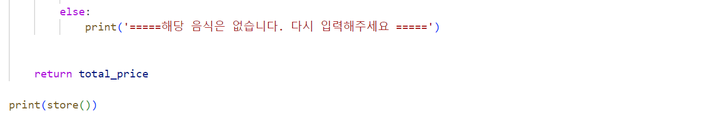
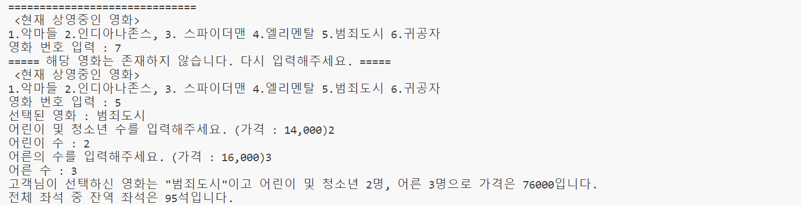

# 🍿 영화관 가격 및 팝콘 가격 계산 서비스📽️
- KDT - 4기 1번째 미니 프로젝트 (개인)
  
---
## 💻 프로젝트 소개
- 원하는 영화를 선택 후 인원수를 선택하면 영화 가격을 계산해주는 서비스 제공
- 원하는 팝콘 사이즈, 음료 사이즈를 선택 후 가격을 계산해주는 서비스 제공

---
## 🕐 프로젝트 기간
- <strong>개발을 위한 공부 :</strong> 2023.06.26. ~ 2023.07.07.
- <strong>실제 개발 기간 : </strong> 2023.07.06. ~ 2023.07.07.

---
## ⚙ 개발 환경
- <strong>Python</strong> (Version 3.9.0 / Window)
- <strong>IDE : </strong> Visual Studio Code

---
## 📁 폴더 및 파일
1. `movie.py` 
영화 관련 함수 실행 파일입니다.

2. `food.py` 
팝콘 및 음료 관련 함수 실행 파일입니다.

---
## 📌 주요 기능
- 청소년과 성인의 가격을 다르게 하여 계산할 수 있게 기능 구현
- 총 100석 중 잔여좌석의 결과도 나올 수 있도록 기능 구현 
(100석 이상일 시 다시 입력 받음)
- 음식 추가 기능 및 콤보 할인 기능 구현
- 번호를 잘못 입력 시 다시 돌아가서 입력할 수 있는 기능 구현

---
## 💿 함수 실행
- 영화

- 팝콘 및 음료

---
## ◼️ 실행 결과
- 영화

- 팝콘 및 음료
