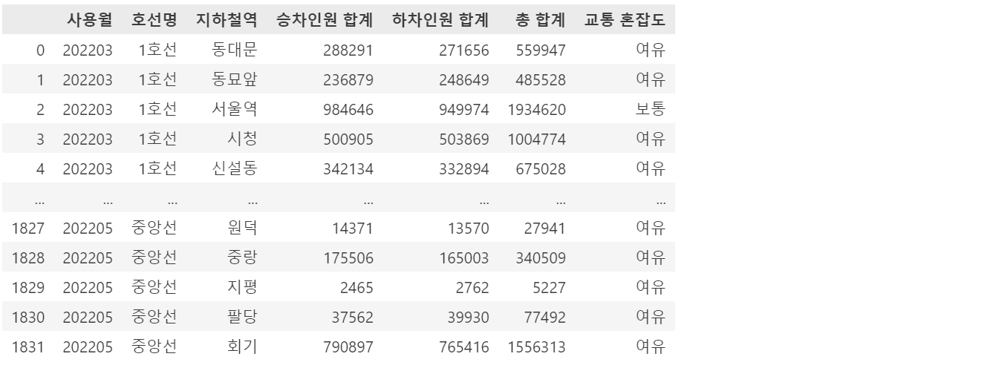

# 🚅 지하철 월별 승하차 분석 🧑‍🤝‍🧑
- KDT - 4기 2번째 미니 프로젝트 (팀)
  
---
## 💻 프로젝트 소개
- 각 월별 다방면 분석
- 각 역별 다방면 분석

---
## 🕐 프로젝트 기간
- <strong>개발을 위한 공부 :</strong> 2023.07.10. ~ 2023.07.14.
- <strong>실제 개발 기간 : </strong> 2023.07.13. ~ 2023.07.14.

---
## ⚙ 개발 환경
- <strong>Python</strong> (Version 3.9.0 / Window)
- <strong>IDE : </strong> Visual Studio Code
- <strong>Framework : </strong> pandas, numpy

---
## 📁 폴더 및 파일
1. `subway_spring.csv` 
지하철 월별 역별 시간대별 (3월, 4월, 5월) 데이터입니다.

2. `subway.ipynb` 
지하철 데이터에 대한 분석 파일입니다.

---
## 📌 주요 기능
- 월별 승하차 합계, 총합계 인원과 상위, 하위 5개역을 알 수 있는 기능
- 승하차 인원 차이를 알 수 있는 기능
- 역별 교통 혼잡도를 3단계로 구분한 결과를 알 수 있는 기능
- (그에 맞는 이유도 함께 명시해두었음.)

---
## 💿 예시
- 역별 승하차, 총 합계 및 교통 혼잡도

- 월별 승하차 인원 차이

---
## ◼️ 결과
- 3 ~ 5월 중 승, 하차 인원이 가장 많은 달은 5월이다.
- 강남과 잠실역이 대체적으로 승하차가 많다.