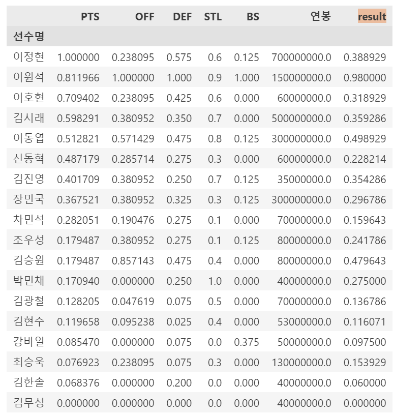
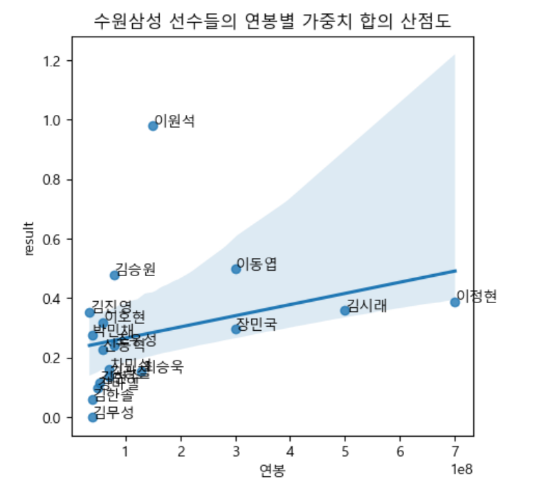
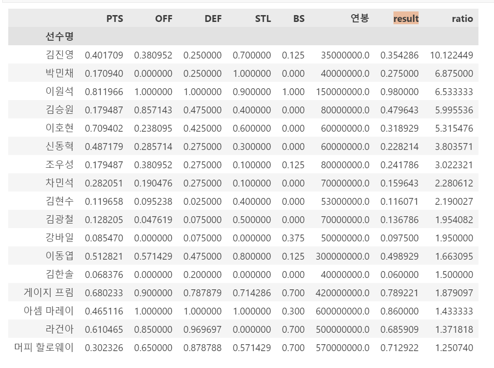

# 🏀 저비용 고효율로 구성된 팀 만들기 프로젝트  🤾‍♀️
- KDT - 4기 3번째 미니 프로젝트 (팀)
  
---
## 💻 프로젝트 소개
- 각종 데이터들로 저비용 고효율의 선수들로 구성하여 좋은 성적을 거두게 하는 것이 목표
- 가장 하위권 팀의 선수들을 다른 팀 선수들과 트레이드하여 높은 성적을 거둘 수 있게 하는 프로젝트

---
## 🕐 프로젝트 기간
- <strong>개발을 위한 공부 :</strong> 2023.07.17. ~ 2023.07.21.
- <strong>실제 개발 기간 : </strong> 2023.07.20. ~ 2023.07.21.

---
## ⚙ 개발 환경
- <strong>Python</strong> (Version 3.9.0 / Window)
- <strong>IDE : </strong> Visual Studio Code
- <strong>Framework : </strong> pandas, numpy, matplotlib, seaborn

---
## 📁 폴더 및 파일
1. `농구팀1.xlsx` `농구팀2.xlsx` 
프로 농구 팀에 대한 각종 (PTS, FT 등) 데이터입니다.

2. `basketball_data.ipynb` 
농구 데이터 전처리 파일입니다.

3. `basketball_project.ipynb` 
농구 데이터 관련 분석 파일입니다.

---
## 📌 주요 기능
- 각종 연봉, 연봉 대비 실력이 좋은지 비율을 알 수 있는 기능
- 회귀선을 통해 잠재력이 있는 선수와 그렇지 않은 선수 구별
- 저비용으로 고효율의 선수들을 서로 트레이드시켜 새로운 팀을 구성

---
## 💿 예시
- 연봉 대비 실력 비율 그래프 및 산점도와 회귀선
<table>
<tr>
<td>

</td>
<td>

</td>
</tr>
</table>

- (새로 구성한) 서울 삼성팀 선수들
<table>
<tr>
<td>

</td>
<td>

<!--  -->
</td>
</tr>
</table>

---
## ◼️ 결과
- 서울 삼성의 장민국, 김시래 등 4명을 방출하고 서울 삼성을 제외한 팀에서 아셈 마레이, 게이지 프림 등 4명을 영입
- 가중치의 합을 비교해보았을 때 (새로 구성한) 서울 삼성팀이 월등히 높은 것을 알 수 있음