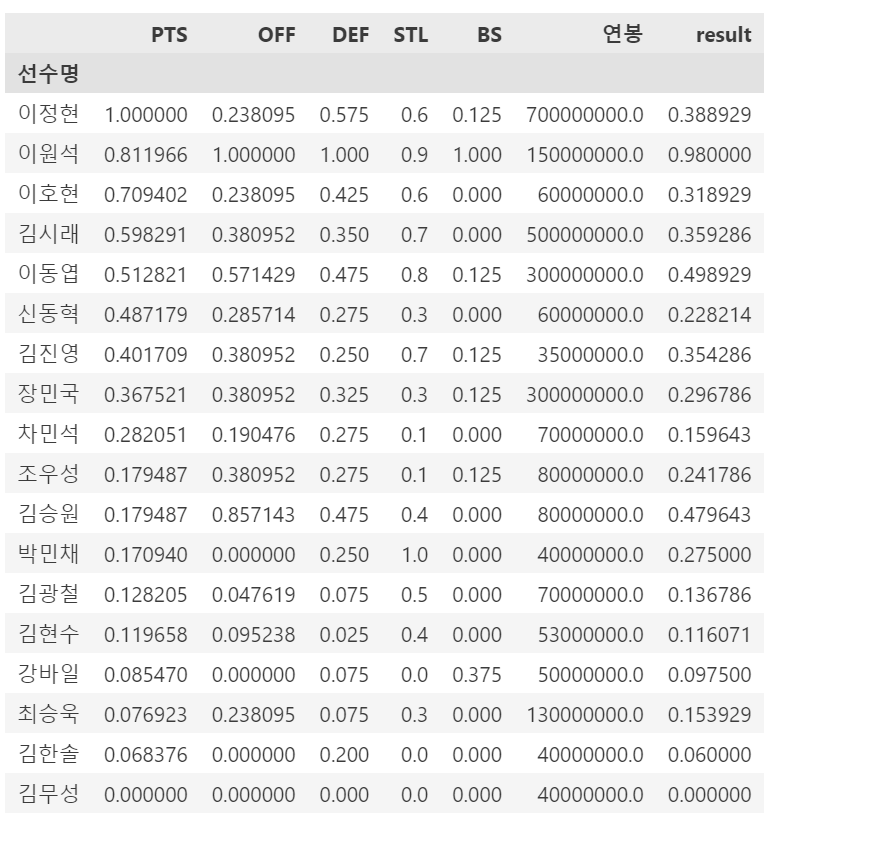
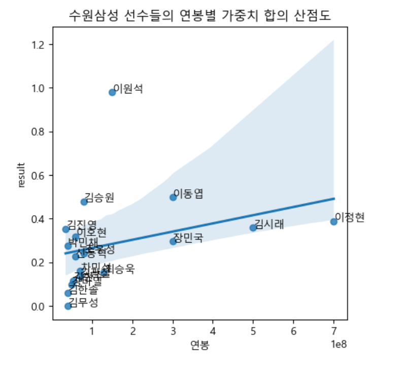

# 🏀 개인 프로필 만들기 프로젝트  🤾‍♀️
- KDT - 4기 4번째 미니 프로젝트 (팀)
  
---
## 💻 프로젝트 소개
- 인스타그램 컨셉의 웹 페이지 제작
- 팀별 웹 페이지 구성 후 개인별 프로필 페이지 구성
- 자기 소개, 관심 분야, 자격증 등 개인 이력과 포트폴리오 관리 페이지 구성

---
## 🕐 프로젝트 기간
- <strong>개발을 위한 공부 :</strong> 2023.07.24. ~ 2023.07.28.
- <strong>실제 개발 기간 : </strong> 2023.07.27. ~ 2023.07.28.

---
## ⚙ 개발 환경
- <strong>Python</strong> (Version 3.9.0 / Window)
- <strong>IDE : </strong> Visual Studio Code
- <strong>HTML, CSS </strong>

---
## 📁 폴더 및 파일
1. `팀_page`/ `outer.html` 
첫 페이지로써 팀원 전체 계정을 연결하는 페이지 파일입니다.

2. `개인_page`/`inner_yunmi.html` 
개인 포트폴리오 페이지 파일입니다.

---
## 📌 주요 기능
- iframe을 통해 내부 페이지를 노출 페이지와 연동
- 팀원 사진 클릭을 통한 개인 페이지 이동
- 내부 링크 구현, 블록과 인라인 속성을 활용하여 헤더 생성, div를 활용하여 사진과 텍스트 영역을 분리

---
## 💿 예시
- 연봉 대비 실력 비율 그래프 및 산점도와 회귀선
<table>
<tr>
<td>

</td>
<td>

</td>
</tr>
</table>

- (새로 구성한) 서울 삼성팀 선수들
<table>
<tr>
<td>

</td>
<td>

</td>
</tr>
</table>

---
## ◼️ 결과
- 서울 삼성의 장민국, 김시래 등 4명을 방출하고 서울 삼성을 제외한 팀에서 아셈 마레이, 게이지 프림 등 4명을 영입
- 가중치의 합을 비교해보았을 때 (새로 구성한) 서울 삼성팀이 월등히 높은 것을 알 수 있음
- 약 5억원의 돈으로 프로 농구에서 상위권 도약을 할 수 있을 것으로 보임